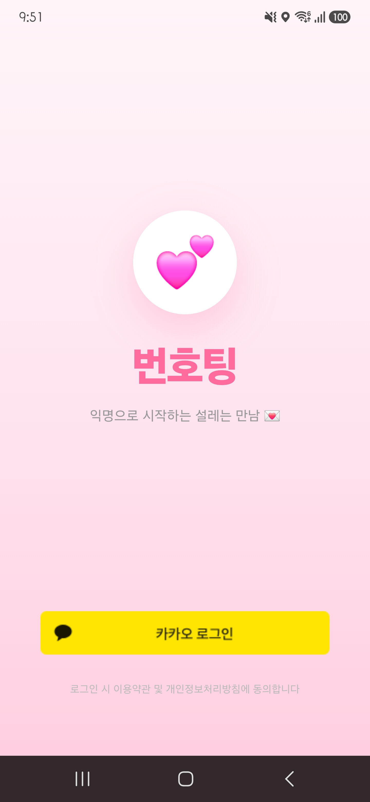

<div align="center">

# 📱 번호팅 채팅 앱

### 대학생을 위한 익명 기반 랜덤 채팅 애플리케이션

전화번호 공개 없이 안전하게 소통할 수 있는  
실시간 랜덤 매칭 채팅 서비스입니다.

<br>


</div>

---

# ✨ 프로젝트 소개

번호팅 채팅 앱은 대학생들을 위한 **익명 랜덤 채팅 애플리케이션**입니다.

사용자는 카카오 로그인을 통해 간편하게 로그인할 수 있으며,  
전화번호와 같은 개인정보를 공개하지 않고 랜덤 매칭 및 실시간 채팅 기능을 이용할 수 있습니다.

또한 학교 이메일 인증 기능을 통해 대학생 사용자만 이용 가능하도록 구현하였습니다.

---

# 🎯 개발 목적

- 개인정보 노출 최소화
- 대학생 대상 안전한 랜덤 채팅 제공
- 실시간 소켓 통신 구현 경험
- Flutter 기반 모바일 앱 개발 학습

---

# 🛠 주요 기능

## 🔐 로그인 기능
- Kakao Login API 기반 로그인
- 카카오 사용자 정보 연동

## 👤 프로필 기능
사용자 정보 관리 기능 제공

- 이름
- 나이
- 성별
- 학과

## 📧 학교 이메일 인증
- 학교 이메일 인증 코드 발송
- `mailer: ^6.0.1` 사용
- 인증 코드 기반 사용자 검증

## 🎲 랜덤 매칭 기능
- 성별 기준 랜덤 매칭
- 매칭 성공 시 자동 채팅방 생성

## 💬 실시간 채팅 기능
- Socket 기반 실시간 채팅 구현
- 사용자 간 1:1 채팅 지원
- `web_socket_channel: ^3.0.1` 사용

---

# 🔄 앱 진행 프로세스

```text
카카오 로그인
   ↓
사용자 정보 입력
   ↓
학교 이메일 인증
   ↓
랜덤 매칭 진행
   ↓
매칭 성공
   ↓
실시간 채팅 시작
```

---

# ⚙ 기술 스택

## Front-End
| 기술 | 설명 |
|---|---|
| Flutter | 모바일 앱 개발 |
| Dart | Flutter 개발 언어 |

---

## Back-End
| 기술 | 설명 |
|---|---|
| Socket | 실시간 채팅 통신 |
| Kakao Login API | 카카오 로그인 |
| mailer | 학교 이메일 인증 |
| web_socket_channel | 웹소켓 통신 |
| kakao_flutter_sdk | 카카오 SDK |

---

## Security
| 기술 | 설명 |
|---|---|
| flutter_dotenv | 환경 변수 관리 |

---

# 📂 프로젝트 구조

```bash
root
│
├─lib
│  ├─backend
│  │  ├─config
│  │  ├─login
│  │  ├─mail
│  │  ├─server
│  │  ├─socket
│  │  └─user_data
│  │
│  └─front
│      ├─models
│      └─screens
│      └─main_navigation.dart
│
│─main.dart 
│      
├─test
├─web
└─windows
```

---

# 📁 폴더 설명

| 폴더                  | 설명           |
|---------------------|--------------|
| `backend/config`    | .env 파일 처리   |
| `backend/login`     | 카카오 로그인 처리   |
| `backend/mail`      | 학교 이메일 인증 처리 |
| `backend/socket`    | 실시간 채팅 소켓 처리 |
| `backend/user_data` | 사용자 데이터 관리   |
| `front/models`      | 사용자 모델 관리    |
| `front/screens`     | 앱 UI 화면 구성   |

---

# 👥 팀(카페인중독) 구성

| 이름      | 담당 |
|---------|---|
| 태철      | Front-End |
| 건욱(팀장 ) | Back-End |
| 동희      | Back-End |

---

# 🧩 담당 업무

## 🎨 Front-End — 태철
- UI / UX 디자인
- 로그인 화면 제작
- 프로필 화면 제작
- 채팅 화면 제작
- 랜덤 매칭 화면 제작

---

## ⚙ Back-End — 건욱
- Kakao Login API 연동
- 사용자 데이터 처리
- 학교 이메일 인증 기능 구현
- `.env` 환경 변수 관리

---

## 🔌 Back-End — 동희
- Socket 기반 실시간 채팅 구현
- 랜덤 매칭 기능 구현
- 채팅방 기능 처리

---

# 🧑‍💻 개발 방식 및 일정

본 프로젝트는 **3인 팀 프로젝트**로 진행되었으며,  
주간 회의를 기반으로 기능 단위 개발 및 테스트를 반복하는  
**경량 Agile 방식**으로 개발을 진행하였습니다.

매주 정기 회의를 통해 진행 상황을 공유하고,  
필요 시 추가 회의를 진행하며 기능 통합 및 문제 해결을 수행하였습니다.

---

# 📅 개발 일정

## 4월 — 기획 및 설계
- 프로젝트 주제 선정
- 주요 기능 정의
- UI / UX 설계
- 기술 스택 선정
- 역할 분담

## 5월 — 기능 개발 및 통합
- Flutter UI 개발
- 카카오 로그인 API 연동
- 실시간 채팅 기능 구현
- 이메일 인증 기능 구현
- 랜덤 매칭 기능 구현
- 기능 통합 및 테스트

## 6월 — 프로젝트 마무리
- 최종 테스트 진행
- 결과 보고서 작성
- 프로젝트 발표 및 제출

---

# 🔒 보안 및 개인정보 보호

- 전화번호 비공개 기반 익명 채팅 제공
- 학교 이메일 인증 기반 사용자 검증
- `.env` 파일 기반 민감 정보 보호
- 최소한의 사용자 정보만 수집

---

# 🚀 실행 방법

```bash
flutter pub get
flutter run
```

---

# 🔥 개선 예정 기능

- Firebase DB 연동
- 채팅 내역 저장 기능
- 신고 기능
- AI 기반 비속어 필터링
- 푸시 알림 기능

---

# 🖼 화면 예시

| 로그인 화면 | 프로필 화면 |
|---|---|
|  |  |

| 채팅 화면 | 매칭 화면 |
|---|---|
|  |  |

# 💡 기대 효과

- 개인정보 노출 없는 안전한 소통 환경 제공
- 대학생 대상 익명 커뮤니티 형성
- Flutter 기반 모바일 앱 개발 경험 확보
- Socket 기반 실시간 통신 구현 경험 확보

---

<div align="center">

### 📚 Team Princess

경량 Agile 방식 기반 팀 프로젝트

</div>